# 🔍 AI-BOM Autopilot

**Auto-discover ML artifacts → Generate standards-compliant CycloneDX ML-BOM → Policy checking → Notifications**

[](./run_all_tests.py)
[](https://python.org)
[](LICENSE)

## 🚀 Quick Start

**One-command setup and demo:**
```bash
git clone https://github.com/SNiPERxDD/ai-bom-autopilot.git
cd ai-bom-autopilot
./run.sh
```

This will:
1. Install dependencies and run comprehensive tests
2. Start the API server (http://localhost:8000)
3. Start the Streamlit UI (http://localhost:8501)

**Monitoring Scan Progress:**
```bash
# View scan progress in real-time
./monitor_scan.py

# Check scan status once without continuous monitoring
./monitor_scan.py --once
```

**Cleanup Script:**
```bash
# Kill all running services
./cleanup.sh
```

**ML Model Detection:**
See [ML Model Detection Documentation](docs/ML_MODEL_DETECTION.md) for details on how the system detects machine learning models like XGBoost and autoencoders, as well as information about repository organization.
3. Start the UI dashboard (http://localhost:8501)
4. Create and run a demo project

## 🏗️ Architecture Overview

ML-BOM Autopilot is a stateful, agentic system orchestrated by LangGraph that automatically discovers AI/ML assets, generates standards-compliant BOMs, and enforces governance policies.

```mermaid
graph TD
    subgraph "Input Sources"
        A[Git Repository]
        C[Hugging Face Hub]
    end
    
    subgraph "LangGraph Workflow"
        B[ScanGit<br/>📁 Discover Files]
        D[ScanHF<br/>🤗 Fetch Cards]
        E[Normalize<br/>🏷️ Classify & License]
        F[Embed+Index<br/>🧠 Vector Embeddings]
        G[BOMGen<br/>📊 CycloneDX ML-BOM]
        H[DiffPrev<br/>🔄 Compare Versions]
        I[PolicyCheck<br/>🛡️ Evaluate Rules]
        J[Notify<br/>📢 Send Alerts]
    end
    
    subgraph "Storage & Search"
        L[TiDB Serverless<br/>🗄️ Vector + SQL]
        S[Hybrid Search<br/>🔍 Vector + FTS/BM25]
    end
    
    subgraph "External Services"
        M[Slack<br/>💬 Webhooks]
        N[Jira<br/>🎫 REST API]
    end
    
    A --> B
    C --> D
    B --> E
    D --> E
    E --> F
    F --> G
    G --> H
    H --> I
    I --> J
    
    F <--> L
    G <--> L
    H <--> L
    I <--> L
    S <--> L
    
    J --> M
    J --> N
    
    style B fill:#e1f5fe
    style D fill:#e8f5e8
    style E fill:#fff3e0
    style F fill:#f3e5f5
    style G fill:#e0f2f1
    style H fill:#fce4ec
    style I fill:#fff8e1
    style J fill:#e8eaf6
```



### Multi-step LangGraph Agent Workflow:

| Step | Component | Purpose | Input | Output |
|------|-----------|---------|-------|--------|
| 1 | **ScanPlan** | Initialize scan metadata | Project config | Scan state |
| 2 | **ScanGit** | Repository discovery | Git repo URL | File candidates |
| 3 | **ScanHF** | External asset fetching | HF model/dataset slugs | Asset metadata |
| 4 | **RuntimeCollect** | Live usage tracing | Running processes | Runtime artifacts |
| 5 | **Normalize** | Artifact classification | Static + runtime data | Classified artifacts |
| 6 | **Embed+Index** | Vector generation | Text content | Embeddings + chunks |
| 7 | **BOMGen** | Standards compliance | Classified artifacts | CycloneDX ML-BOM |
| 8 | **DiffPrev** | Change detection | Current + previous BOM | Structural diff |
| 9 | **PolicyCheck** | Governance evaluation | BOM diff + rules | Policy violations |
| 10 | **Notify** | Alert distribution | Policy events | External notifications |

**Key Features:**
- ⏱️ **Timeout Protection**: All nodes have configurable timeouts (60s-600s)
- 🔄 **Retry Logic**: Exponential backoff for transient failures
- 🎯 **Conditional Logic**: Smart skipping (e.g., no diff for first BOM)
- 🔒 **Tool Allowlist**: Only approved notification channels (Slack, Jira)
- 🧪 **DRY_RUN Mode**: Safe testing without side effects

## ✨ Key Features

### Dual-Mode AI Asset Discovery
- **Static Analysis**: Repository scanning for models, datasets, prompts, tools
- **Runtime Tracing**: eBPF-based syscall monitoring for live AI/ML usage
- **Hybrid Detection**: Combines static and runtime discovery for complete coverage
- **Real-time Monitoring**: Captures actual AI component usage during execution

### Standards Compliance
- **CycloneDX ML-BOM v1.5**: Industry-standard ML bill of materials
- **SPDX License Mapping**: Automated license detection and classification
- **Schema Validation**: Built-in validation using cyclonedx-python-lib
- **Audit Trail**: SHA256 hashes and comprehensive action logging

### Runtime AI-BOM Tracing
- **eBPF Syscall Monitoring**: Kernel-level tracing with minimal overhead
- **Smart Filtering**: Focuses on AI/ML artifacts (.pt, .bin, .safetensors, etc.)
- **Process Tracking**: Monitors file access and network calls by ML processes
- **Fallback Support**: Process monitoring when eBPF is unavailable

### Hybrid Search & AI
- **Vector Search**: Semantic similarity using TiDB VEC_COSINE_DISTANCE
- **Full-text Search**: MATCH(...) AGAINST(...) with BM25 fallback
- **Multi-provider Embeddings**: OpenAI (1536D) and Gemini (768D) support
- **Reciprocal Rank Fusion**: Combines vector and keyword results

### Policy Engine
- **5 Starter Policies**: License violations, model drift, prompt changes
- **Severity Levels**: Low, medium, high, critical classifications
- **Deduplication**: Prevents alert fatigue with 24-hour windows
- **Override Support**: Temporary waivers with expiration dates

### Enterprise Integrations
- **Slack Webhooks**: Rich notifications with Blocks API
- **Jira Tickets**: Automated issue creation via REST API
- **Action Logging**: Every external call logged for compliance
- **DRY_RUN Mode**: Safe testing without side effects

### Resilience & Fallbacks
- **Graceful Degradation**: Works without vector/full-text support
- **Smart Fallbacks**: BM25 → LIKE search when features unavailable
- **Timeout Protection**: All workflow nodes have timeout guards
- **Retry Logic**: Exponential backoff for transient failures

## 🔧 Environment Setup

### Required Variables
```bash
# Database (TiDB Serverless)
TIDB_URL=mysql+pymysql://user.cluster.tidbcloud.com:4000/database
DB_USER=your-username
DB_PASS=your-password

# Embedding Provider (choose one)
EMBED_PROVIDER=openai  # or 'gemini'
EMBEDDING_DIM=1536     # 1536 for OpenAI, 768 for Gemini
OPENAI_API_KEY=sk-your-openai-key
# GEMINI_API_KEY=your-gemini-key

# Optional: Notifications
SLACK_WEBHOOK_URL=https://hooks.slack.com/services/...
JIRA_URL=https://your-company.atlassian.net
JIRA_USERNAME=your-email@company.com
JIRA_API_TOKEN=your-jira-token

# Optional: Configuration
DRY_RUN=false
LOG_LEVEL=INFO

# Runtime Tracing
RUNTIME_TRACING=true
RUNTIME_DURATION=30
```

### Setup Instructions

1. **Clone and Install**
   ```bash
   git clone https://github.com/SNiPERxDD/ai-bom-autopilot.git
   cd ai-bom-autopilot
   cp .env.example .env
   # Edit .env with your credentials
   ```
2. **Quick setup & run**
   ```bash
   ./run.sh
   ```

## ⚡ Runtime AI-BOM Tracing

### eBPF-Based Live Monitoring
ML-BOM Autopilot includes groundbreaking runtime tracing capabilities that capture AI/ML components actually used during execution, not just what's in your repository.

```bash
# Enable runtime tracing (default: enabled)
export RUNTIME_TRACING=true
export RUNTIME_DURATION=30  # seconds

# Run scan with runtime collection
curl -X POST http://localhost:8000/scan \
  -H "Content-Type: application/json" \
  -d '{"project": "demo", "dry_run": false}'

# Or run runtime-only scan
curl -X POST http://localhost:8000/scan/runtime \
  -H "Content-Type: application/json" \
  -d '{"project": "demo", "duration": 60}'
```

### How Runtime Tracing Works
1. **eBPF Syscall Hooks**: Monitors `open()`, `read()`, `connect()` syscalls at kernel level
2. **Smart Filtering**: Focuses on AI/ML file patterns (.pt, .bin, .safetensors, HF cache)
3. **Process Tracking**: Identifies ML processes (python, jupyter, torch, transformers)
4. **Real-time Capture**: Records actual model loads, dataset access, prompt usage
5. **Fallback Mode**: Uses process monitoring when eBPF is unavailable

### Runtime vs Static Analysis
| Aspect | Static Analysis | Runtime Tracing |
|--------|----------------|-----------------|
| **Coverage** | Repository files | Actually used components |
| **Accuracy** | All possible assets | Only loaded assets |
| **Performance** | Fast, one-time | Continuous, low overhead |
| **Dependencies** | Git access | Running application |
| **Use Case** | Compliance, inventory | Operational visibility |

### Example Runtime Workflow
```python
# Start your ML application
python examples/example_runtime_ml_app.py &

# In another terminal, run runtime scan
curl -X POST http://localhost:8000/scan/runtime \
  -d '{"project": "demo", "duration": 30}'

# View results in UI at http://localhost:8501
# Runtime tab shows live AI/ML usage
```

## 🎯 Demo Workflow

### Automated Demo
```bash
# Create demo project with sample ML artifacts
python seed/create_demo_project.py

# Run initial scan (generates BOM v1)
curl -X POST http://localhost:8000/scan -H "Content-Type: application/json" -d '{"project": "demo"}'

# Apply changes (model upgrade, license change)
python seed/apply_demo_changes.py

# Run second scan (generates BOM v2 with diff and policy events)
curl -X POST http://localhost:8000/scan -H "Content-Type: application/json" -d '{"project": "demo"}'
```

### Expected Results
- **BOM v1**: 3 models, 2 datasets, 5 prompts, 1 tool
- **BOM v2**: Model version bump (8B→70B), license change
- **Policy Events**: Major version bump detected, license violation flagged
- **Notifications**: Slack alert sent, Jira ticket created

### Access Points
- **API Documentation**: http://localhost:8000/docs (OpenAPI/Swagger)
- **UI Dashboard**: http://localhost:8501 (Streamlit interface)
- **Health Check**: http://localhost:8000/health

## 📊 System Capabilities

### Database Features
- **Vector Functions**: TiDB VEC_COSINE_DISTANCE support
- **Full-text Search**: MATCH(...) AGAINST(...) when available
- **Fallback Search**: BM25 and LIKE search alternatives
- **Migration System**: Automated schema updates and vector resizing

### Performance Metrics
- **Throughput**: ~120 chunks/sec with 8 workers
- **Storage**: ~6KB per vector chunk
- **Scalability**: Stateless services with queue architecture
- **Caching**: TTL-based HuggingFace API response caching

### Security & Compliance
- **Secrets Management**: Environment variables only
- **Input Validation**: Comprehensive sanitization
- **Audit Logging**: Every action tracked with request/response
- **Tool Allowlist**: Only approved notification channels

## 🧪 Testing & Validation

### Comprehensive Test Suite
```bash
# Run all tests
python run_all_tests.py

# Individual test components
python core/graph/selftest.py        # System capabilities
python test_e2e_mock.py              # End-to-end workflow
python test_hybrid_search.py         # Search functionality
python test_bom_generator.py         # BOM generation
python test_policy_engine.py         # Policy evaluation
```

### Test Coverage
- ✅ **Dependency Installation**: All packages import successfully
- ✅ **System Self-test**: Database, vector, FTS capabilities
- ✅ **SQL Syntax**: All queries validate against schema
- ✅ **API Structure**: 15 endpoints with proper routing
- ✅ **Workflow Integration**: End-to-end mock execution
- ✅ **Component Testing**: Individual service validation

## 📁 Project Structure

```
ai-bom-autopilot/
├── 🚀 apps/                    # Application interfaces
│   ├── api/                   # FastAPI server (REST API)
│   └── ui/                    # Streamlit dashboard (Web UI)
├── ⚙️ core/                    # Core business logic
│   ├── bom/                   # BOM generation (CycloneDX)
│   ├── db/                    # Database connection & migrations
│   ├── diff/                  # BOM comparison engine
│   ├── embeddings/            # Multi-provider embedding service
│   ├── graph/                 # LangGraph workflow orchestration
│   ├── mcp_tools/             # External integrations (Slack, Jira)
│   ├── normalize/             # Artifact classification
│   ├── policy/                # Policy evaluation engine
│   ├── scan_git/              # Git repository scanner
│   ├── scan_hf/               # HuggingFace API client
│   ├── schemas/               # Data models and validation
│   └── search/                # Hybrid search engine
├── 🌱 seed/                    # Demo data and test projects
├── 📚 docs/                    # Implementation documentation
├── 💡 examples/                # Usage examples and tutorials
├── 🧪 tests/                   # Comprehensive test suite
├── 🐳 Dockerfile              # Container configuration
├── 🔧 docker-compose.yml      # Multi-service orchestration
├── 📋 requirements.txt        # Python dependencies
├── 🏃 run.sh                  # One-command startup script
└── 📖 README.md               # This file
```

### Directory Purposes

| Directory | Purpose | Key Files |
|-----------|---------|-----------|
| `apps/` | User interfaces | `api/main.py`, `ui/streamlit_app.py` |
| `core/` | Business logic | All core modules with README |
| `seed/` | Demo & testing | `create_demo_project.py`, `sample_project/` |
| `docs/` | Documentation | Implementation guides, migration docs |
| `examples/` | Usage patterns | Component usage examples |
| `tests/` | Test suite | Unit, integration, and E2E tests |

## 🔄 Switching Embedding Providers

### OpenAI to Gemini
```bash
# Update .env
EMBED_PROVIDER=gemini
EMBEDDING_DIM=768
GEMINI_API_KEY=your-gemini-key

# Resize vector column
python -m core.db.migrations resize-vector --dimension 768

# Restart application
./run.sh
```

### Gemini to OpenAI
```bash
# Update .env
EMBED_PROVIDER=openai
EMBEDDING_DIM=1536
OPENAI_API_KEY=sk-your-openai-key

# Resize vector column
python -m core.db.migrations resize-vector --dimension 1536

# Restart application
./run.sh
```

## 🚨 Troubleshooting

### Common Issues

**"No embedding client available"**
- Check API keys in .env file
- Verify provider is set correctly (openai/gemini)
- Ensure required packages are installed

**"Vector functions not available"**
- TiDB cluster may not support vector functions
- Service will continue with keyword-only search
- Check TiDB region and plan compatibility

**"FTS disabled -> BM25(app)"**
- TiDB region doesn't support FULLTEXT search
- Automatic fallback to BM25 library
- No action required, system continues normally

**Database connection errors**
- Verify TiDB credentials in .env
- Check network connectivity
- Ensure database exists and migrations are applied

### Debug Mode
```bash
# Enable debug logging
LOG_LEVEL=DEBUG ./run.sh

# Run system self-test
python core/graph/selftest.py

# Check database status
python -m core.db.migrations status
```

## 📈 Scalability Considerations

### Horizontal Scaling
- **Stateless Services**: API and workflow nodes can be replicated
- **Queue Architecture**: Async processing with message queues
- **Database Sharding**: TiDB supports horizontal scaling
- **Caching Layer**: Redis for session and API response caching

### Performance Optimization
- **Batch Processing**: Configurable batch sizes for embeddings
- **Connection Pooling**: Database connection management
- **Lazy Loading**: On-demand component initialization
- **Result Pagination**: API endpoints support pagination

## 🏆 Compliance & Standards

### Regulatory Readiness
- **EU AI Act**: CycloneDX ML-BOM for transparency requirements
- **SOC 2**: Comprehensive audit logging and access controls
- **GDPR**: No PII storage, configurable data retention
- **NIST**: Security framework alignment with best practices

### Industry Standards
- **CycloneDX v1.5**: Latest ML-BOM specification
- **SPDX**: Standardized license identification
- **OpenAPI 3.0**: API documentation and client generation
- **JSON Schema**: Data validation and type safety

## 📝 License

MIT License - see [LICENSE](LICENSE) file for details.

## 🤝 Contributing

1. Fork the repository
2. Create a feature branch
3. Add tests for new functionality
4. Ensure all tests pass
5. Submit a pull request

## 📞 Support

- **Documentation**: See `/docs` directory for detailed guides
- **Examples**: Check `/examples` for usage patterns
- **Issues**: Report bugs via GitHub issues
- **Discussions**: Use GitHub discussions for questions

---

**Built with ❤️ for AI governance and transparency**