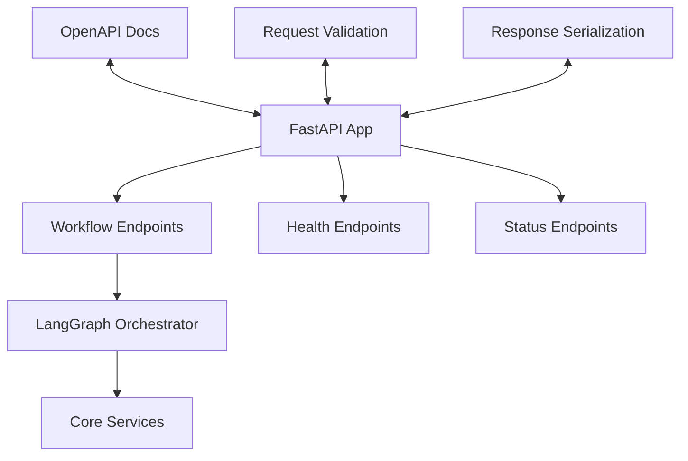
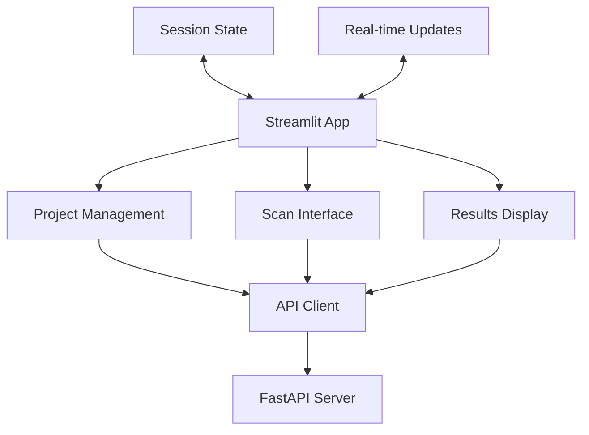

# Application Interfaces

This directory contains the user-facing application interfaces for AI-BOM Autopilot.

## Applications

### 🚀 API Server (`api/`)
- **Purpose**: RESTful API server using FastAPI
- **Key Files**: `main.py` - FastAPI application with all endpoints
- **Features**: 
  - OpenAPI/Swagger documentation
  - Workflow orchestration endpoints
  - Health checks and status reporting
  - Request/response validation

#### Key Endpoints
- `POST /scan` - Trigger ML-BOM scan workflow
- `GET /health` - System health and capabilities
- `GET /workflow/status` - Workflow configuration
- `GET /docs` - Interactive API documentation

### 🖥️ User Interface (`ui/`)
- **Purpose**: Web-based dashboard using Streamlit
- **Key Files**: `streamlit_app.py` - Interactive dashboard
- **Features**:
  - Project management interface
  - Scan execution and monitoring
  - Results visualization (BOM, Diff, Policy, Actions)
  - Real-time status updates

#### Dashboard Sections
- **Project Selector**: Choose and manage projects
- **Scan Controls**: Run scans with dry-run option
- **Results Tabs**: BOM, Diff, Policy Events, Actions
- **System Status**: Health indicators and capabilities

## Architecture

### API Server Architecture


### UI Architecture


## Development

### Running Applications

#### API Server
```bash
# Development mode
cd ai-bom-autopilot
python -m apps.api.main

# Production mode
uvicorn apps.api.main:app --host 0.0.0.0 --port 8000
```

#### UI Dashboard
```bash
# Development mode
cd ai-bom-autopilot
streamlit run apps/ui/streamlit_app.py

# Production mode
streamlit run apps/ui/streamlit_app.py --server.port 8501 --server.address 0.0.0.0
```

#### Both Applications
```bash
# Use the convenience script
./run.sh
```

### Configuration

#### Environment Variables
Both applications use the same environment configuration:
- Database connection settings
- API keys for embedding providers
- Notification service credentials
- Application-specific settings

#### API Configuration
- **Host**: `0.0.0.0` (configurable via `API_HOST`)
- **Port**: `8000` (configurable via `API_PORT`)
- **Workers**: `1` (configurable via `API_WORKERS`)
- **Log Level**: `INFO` (configurable via `LOG_LEVEL`)

#### UI Configuration
- **Host**: `0.0.0.0` (configurable via `UI_HOST`)
- **Port**: `8501` (configurable via `UI_PORT`)
- **Theme**: Light/Dark mode support
- **Auto-refresh**: Configurable refresh intervals

### API Documentation

#### Interactive Documentation
- **Swagger UI**: http://localhost:8000/docs
- **ReDoc**: http://localhost:8000/redoc
- **OpenAPI JSON**: http://localhost:8000/openapi.json

#### Request/Response Examples

**Trigger Scan**
```bash
curl -X POST http://localhost:8000/scan \
  -H "Content-Type: application/json" \
  -d '{"project": "demo", "dry_run": false}'
```

**Check Health**
```bash
curl http://localhost:8000/health
```

### UI Features

#### Project Management
- Create and select projects
- View project metadata and statistics
- Manage project configurations

#### Scan Execution
- One-click scan execution
- Dry-run mode for testing
- Real-time progress monitoring
- Scan history and results

#### Results Visualization
- **BOM Tab**: CycloneDX ML-BOM viewer with component details
- **Diff Tab**: Visual comparison between BOM versions
- **Policy Tab**: Policy violations with severity indicators
- **Actions Tab**: External notifications and audit trail

#### System Monitoring
- Database connection status
- Vector and full-text search capabilities
- API key validation status
- Performance metrics and counters

### Security Considerations

#### API Security
- Input validation using Pydantic models
- SQL injection prevention with parameterized queries
- Rate limiting (configurable)
- CORS configuration for cross-origin requests

#### UI Security
- Session state management
- Secure credential handling
- No sensitive data in client-side storage
- HTTPS support in production

### Deployment

#### Docker Deployment
```dockerfile
# API Server
FROM python:3.11-slim
COPY . /app
WORKDIR /app
RUN pip install -r requirements.txt
CMD ["uvicorn", "apps.api.main:app", "--host", "0.0.0.0", "--port", "8000"]
```

#### Production Considerations
- **Load Balancing**: Multiple API server instances
- **Reverse Proxy**: Nginx for static files and SSL termination
- **Process Management**: Supervisor or systemd for service management
- **Monitoring**: Health checks and metrics collection
- **Logging**: Structured logging with log aggregation

### Testing

#### API Testing
```bash
# Unit tests
python -m pytest tests/test_api_*.py

# Integration tests
python tests/test_api_workflow.py

# Load testing
locust -f tests/load_test_api.py
```

#### UI Testing
```bash
# UI functionality tests
python tests/test_ui.py

# End-to-end tests
python tests/test_e2e_ui.py
```

### Monitoring and Observability

#### Metrics
- Request/response times
- Error rates and status codes
- Workflow execution times
- Database query performance

#### Logging
- Structured JSON logging
- Request/response logging
- Error tracking with stack traces
- Performance monitoring

#### Health Checks
- Database connectivity
- External service availability
- System resource usage
- Application-specific health indicators