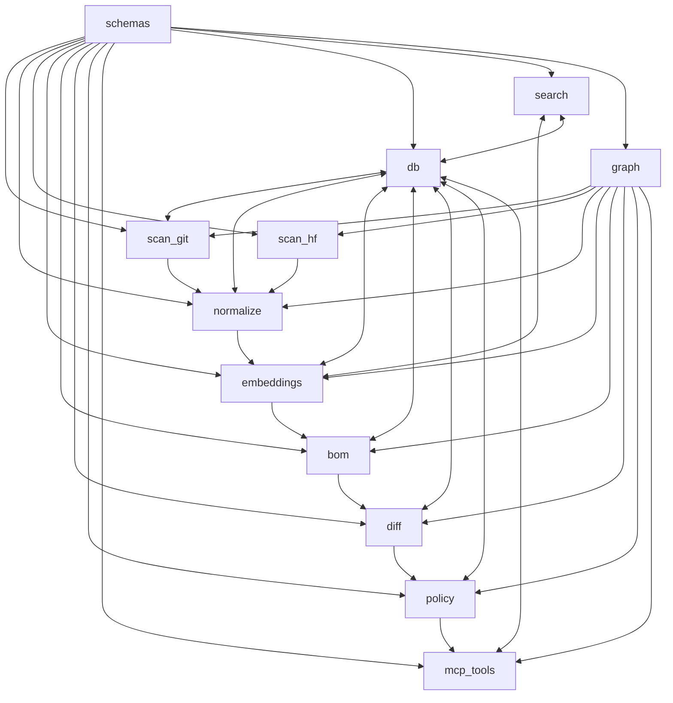

# Core Business Logic

This directory contains the core business logic modules for AI-BOM Autopilot.

## Modules

### 📊 BOM Generation (`bom/`)
- **Purpose**: Generate standards-compliant CycloneDX ML-BOMs
- **Key Files**: `generator.py` - BOM creation and validation
- **Standards**: CycloneDX v1.5, SPDX license mapping
- **Features**: SHA256 hashing, validation with cyclonedx-python-lib

### 🗄️ Database (`db/`)
- **Purpose**: Database connection, migrations, and schema management
- **Key Files**: 
  - `connection.py` - TiDB connection management
  - `migrations.py` - Schema migrations and updates
  - `resize_vector_migration.py` - Vector column resizing
- **Features**: Connection pooling, graceful degradation, vector support detection

### 🔄 Diff Engine (`diff/`)
- **Purpose**: Structural comparison of BOM versions
- **Key Files**: `engine.py` - BOM comparison logic
- **Features**: Stable component IDs, semantic diff generation, change tracking

### 🧠 Embeddings (`embeddings/`)
- **Purpose**: Multi-provider embedding generation and text processing
- **Key Files**: `embedder.py` - Embedding service with chunking
- **Providers**: OpenAI (1536D), Gemini (768D)
- **Features**: Text chunking, token counting, batch processing

### 🔀 Workflow Orchestration (`graph/`)
- **Purpose**: LangGraph workflow orchestration and state management
- **Key Files**: 
  - `workflow.py` - Main workflow definition
  - `selftest.py` - System capability testing
- **Features**: Timeout protection, retry logic, state management

### 🔗 External Integrations (`mcp_tools/`)
- **Purpose**: External service integrations (Slack, Jira)
- **Key Files**: 
  - `slack.py` - Slack webhook notifications
  - `jira.py` - Jira ticket creation
- **Features**: Rich notifications, audit logging, error handling

### 🏷️ Normalization (`normalize/`)
- **Purpose**: Artifact classification and license detection
- **Key Files**: `classifier.py` - ML artifact classification
- **Features**: SPDX license mapping, artifact type detection, metadata extraction

### 🛡️ Policy Engine (`policy/`)
- **Purpose**: Compliance rule evaluation and violation detection
- **Key Files**: `engine.py` - Policy evaluation logic
- **Features**: 5 starter policies, severity levels, deduplication, overrides

### 📁 Git Scanning (`scan_git/`)
- **Purpose**: Git repository scanning and artifact discovery
- **Key Files**: `scanner.py` - Repository walker
- **Features**: .gitignore respect, file type detection, commit tracking

### 🤗 HuggingFace Integration (`scan_hf/`)
- **Purpose**: HuggingFace Hub API integration and caching
- **Key Files**: `fetcher.py` - HF API client with caching
- **Features**: TTL caching, batch fetching, metadata parsing

### 📋 Data Models (`schemas/`)
- **Purpose**: Pydantic data models and validation schemas
- **Key Files**: `models.py` - All data model definitions
- **Features**: Type safety, validation, serialization

### 🔍 Search Engine (`search/`)
- **Purpose**: Hybrid vector and keyword search
- **Key Files**: `engine.py` - Hybrid search implementation
- **Features**: Vector similarity, FULLTEXT search, BM25 fallback, RRF fusion

## Architecture Principles

### Modularity
- Each module has a single responsibility
- Clear interfaces between components
- Minimal coupling, high cohesion

### Resilience
- Graceful degradation when features unavailable
- Comprehensive error handling
- Timeout protection and retry logic

### Extensibility
- Plugin architecture for new providers
- Configurable policies and rules
- Modular workflow components

### Performance
- Batch processing where applicable
- Connection pooling and caching
- Efficient algorithms (RRF, BM25)

## Integration Flow

## Development Guidelines

### Adding New Modules
1. Create module directory under `core/`
2. Add `__init__.py` with public interface
3. Implement main logic in descriptively named files
4. Add comprehensive error handling
5. Include unit tests
6. Update this README

### Error Handling
- Use structured logging with appropriate levels
- Implement graceful degradation
- Provide meaningful error messages
- Include context in exceptions

### Testing
- Unit tests for all public methods
- Integration tests for cross-module interactions
- Mock external dependencies
- Test error conditions and edge cases

### Documentation
- Docstrings for all public functions/classes
- Type hints for all parameters and returns
- README for complex modules
- Usage examples where helpful